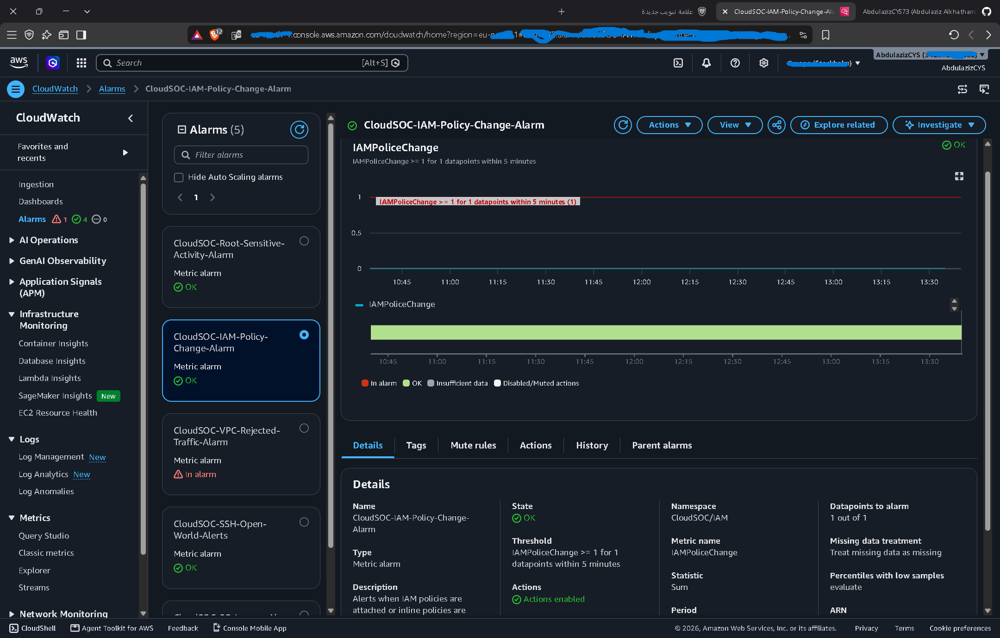

# Detection 01 — Security Group Ingress Change

## Overview

Detects changes that add inbound rules to AWS Security Groups.

The detection monitors CloudTrail events for AuthorizeSecurityGroupIngress.

## Objective

Identify unauthorized or unexpected changes to Security Group inbound rules that could expose AWS resources to unwanted network access.

## Detection Logic

### CloudTrail Event

The detection monitors the following CloudTrail event:

AuthorizeSecurityGroupIngress
This event is generated when an inbound rule is added or modified on an AWS Security Group.

### Metric Filter

The CloudWatch Logs metric filter uses the following pattern:
'''text
{ $.eventName = "AuthorizeSecurityGroupIngress" }

## Metric

- Namespace: CloudSOC/Security

- Metric Name: SecurityGroupIngressChanges

- Metric Value: 1

- Default Value: 0

- Statistic: Sum

## Alert Threshold

The CloudWatch alarm triggers when:

SecurityGroupIngressChanges >= 1

within the configured evaluation period.

## Notification

When the alarm enters the ALARM state, Amazon SNS sends a security alert notification by email.

## Testing & Validation

The detection was validated by generating a Security Group ingress change in AWS.

A test ingress rule was added to a Security Group, which generated the following CloudTrail event:

- Event: `AuthorizeSecurityGroupIngress`
- Source: AWS CloudTrail
- Metric: `SecurityGroupIngressChanges`
- Alarm: `CloudSOC-SG-Ingress-Alarm`
- Notification: Amazon SNS

The CloudWatch alarm successfully transitioned to `ALARM` and an SNS email notification was received.

The test rule was subsequently removed using:

`RevokeSecurityGroupIngress`

This confirmed the end-to-end detection flow:

CloudTrail → CloudWatch Logs → Metric Filter → CloudWatch Alarm → SNS → Email

### Expected Detection Flow

IAM Policy Change
↓ 
AWS CloudTrail
↓
CloudWatch Logs 
↓ 
Metric Filter 
↓
CloudWatch Metric
↓
CloudWatch Alarm 
↓
Amazon SNS 
↓
Email Alert

## Evidence

### IAM Policy Change Alert

The detection was validated by performing an IAM policy attachment operation.

The CloudWatch alarm transitioned from OK to ALARM, and an Amazon SNS notification was successfully delivered by email.

