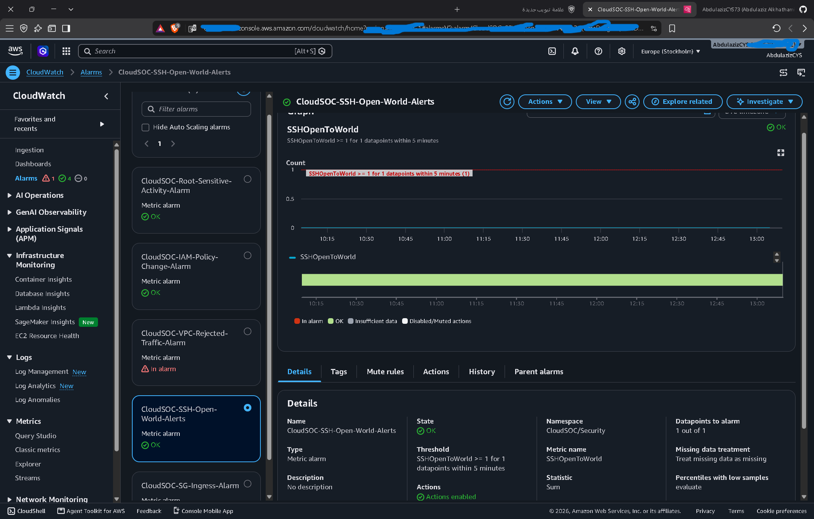

# Detection 02 — SSH Open to World

## Overview

Detects Security Group inbound rules that expose SSH (TCP port 22) to the public internet.

This type of exposure can increase the risk of unauthorized access and automated scanning against EC2 instances.

## Objective

Identify Security Group changes that allow inbound SSH access from `0.0.0.0/0`.

The detection is designed to identify potentially dangerous network exposure as soon as the rule is created.

## Detection Logic

The detection monitors CloudTrail events for changes to Security Group inbound rules.

It specifically identifies rules that:

- Allow TCP traffic
- Use destination port `22`
- Allow traffic from `0.0.0.0/0`

The CloudWatch Logs metric filter used for this detection is:

```text
{ ($.eventName = "AuthorizeSecurityGroupIngress") && ($.requestParameters.ipPermissions.items[0].fromPort = 22) && ($.requestParameters.ipPermissions.items[0].toPort = 22) && ($.requestParameters.ipPermissions.items[0].ipRanges.items[0].cidrIp = "0.0.0.0/0") }
```
## Testing & Validation

The detection was tested by creating a Security Group inbound rule that allowed SSH access over TCP port `22` from `0.0.0.0/0`.

This simulated a potentially dangerous configuration change that exposes an EC2 instance to the public internet.

### Test Result

The CloudTrail event was successfully recorded and matched the configured metric filter.

The `SSHOpenToWorld` metric was generated, and the CloudWatch alarm `CloudSOC-SSH-Open-World-Alerts` evaluated the event successfully.

The test rule was then removed to restore the intended Security Group configuration.

This validated the complete detection pipeline:
```text
Security Group Change
        ↓
CloudTrail
        ↓
CloudWatch Logs
        ↓
Metric Filter
        ↓
SSHOpenToWorld Metric
        ↓
CloudWatch Alarm
        ↓
SNS Notification
```

## Evidence

The following screenshot demonstrates the configured CloudWatch alarm for the SSH Open to World detection.


