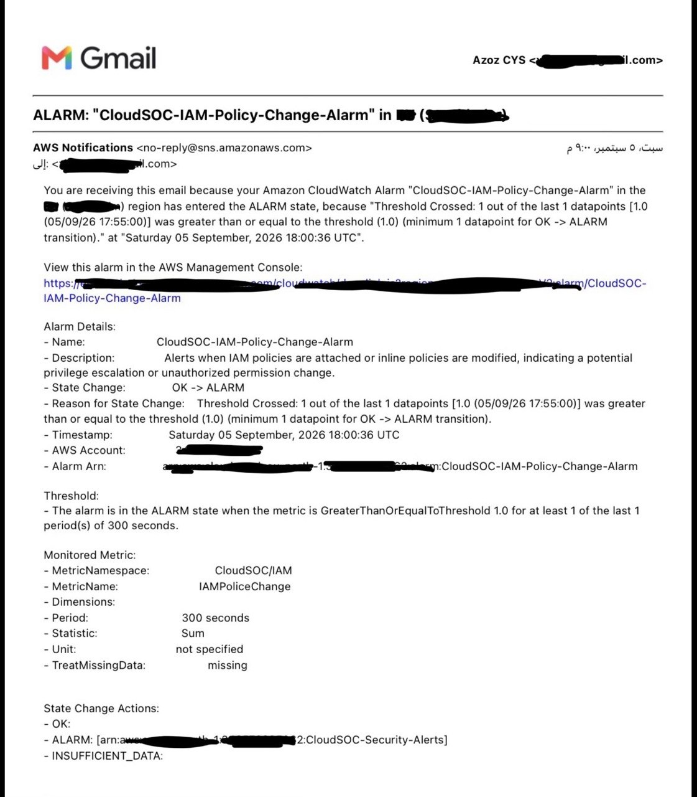

# Detection 03 — IAM Policy Change

## Overview

Detects changes to AWS IAM policies that may affect the permissions or privileges of users and roles.

Unauthorized IAM policy changes can increase privileges, provide access to additional AWS resources, or support privilege escalation.

This detection monitors CloudTrail events for policy attachment and inline policy modification activities.

## Objective

Identify IAM policy changes that may introduce unauthorized or excessive permissions.

The detection focuses on the following IAM events:

- `AttachUserPolicy`
- `AttachRolePolicy`
- `PutUserPolicy`
- `PutRolePolicy`

These events can indicate that permissions have been added or modified for an IAM user or role.

## Detection Logic

The detection monitors AWS CloudTrail events for IAM policy changes.

The CloudWatch Logs metric filter used for this detection is:

```text
{ ($.eventName = "AttachUserPolicy") || ($.eventName = "AttachRolePolicy") || ($.eventName = "PutUserPolicy") || ($.eventName = "PutRolePolicy") }
```

## Alert Configuration

| Setting | Value |
|---|---|
| Alarm Name | `CloudSOC-IAM-Policy-Change-Alarm` |
| Namespace | `CloudSOC/IAM` |
| Metric | `IAMPolicyChanges` |
| Statistic | Sum |
| Period | 5 minutes |
| Threshold | `>= 1` |
| Notification | Amazon SNS |
| Current State | OK |


## Investigation Query

The following CloudWatch Logs Insights query can be used to investigate IAM policy changes:

```text
fields @timestamp,
       eventName,
       userIdentity.type,
       userIdentity.arn,
       requestParameters.roleName,
       requestParameters.policyArn
| filter eventSource = "iam.amazonaws.com"
| filter eventName in [
    "AttachUserPolicy",
    "AttachRolePolicy",
    "PutUserPolicy",
    "PutRolePolicy"
]
| sort @timestamp desc
| limit 50
```

## Testing & Validation

The detection was tested by creating a temporary IAM role and attaching a low-risk AWS managed policy to the role.

This simulated an IAM permission change that could potentially represent an unauthorized privilege modification.

### Test Result

The CloudTrail event was successfully recorded and matched the configured metric filter.

The `IAMPolicyChanges` metric was generated, and the CloudWatch alarm `CloudSOC-IAM-Policy-Change-Alarm` transitioned to the alarm state.

An SNS notification was successfully delivered to the configured security alert subscription.

The test policy was then detached after validation.

This validated the complete detection pipeline:

```text
IAM Policy Change
        ↓
CloudTrail
        ↓
CloudWatch Logs
        ↓
Metric Filter
        ↓
IAMPolicyChanges Metric
        ↓
CloudWatch Alarm
        ↓
SNS Notification
```

## Expected Detection

The detection should trigger whenever one of the monitored IAM policy modification events occurs.

A security analyst should then investigate:

1. Who performed the change?
2. Which user or role was affected?
3. Which policy was attached or modified?
4. Was the change authorized?
5. Did the change introduce excessive privileges?

## Security Relevance

IAM policy changes are security-sensitive because they can modify the permissions available to AWS identities.

An attacker who gains access to an AWS identity may attempt to modify IAM permissions to obtain additional privileges or maintain access to cloud resources.

Monitoring these events provides an early detection mechanism for potentially unauthorized privilege changes.

## Evidence

The following screenshot demonstrates the CloudWatch alarm successfully detecting an IAM policy change.


