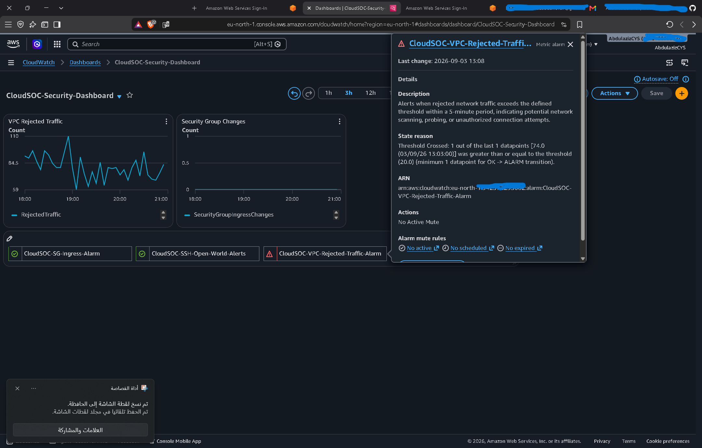
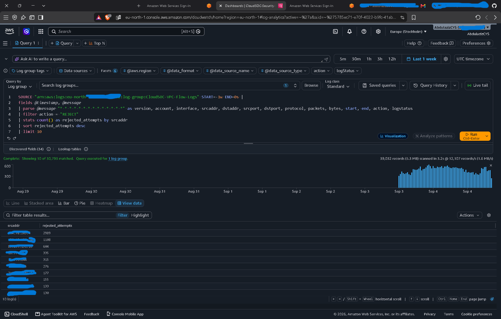
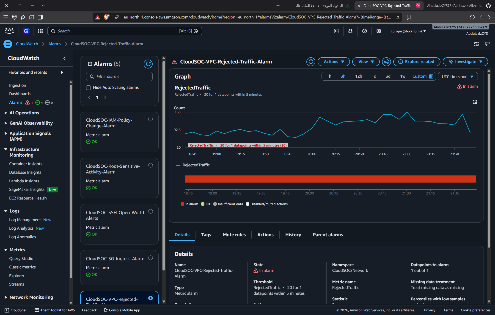

# INC-001 — Suspected TCP Port Scanning

## Incident Summary

- Incident ID: INC-001
- Incident Type: Network Reconnaissance / TCP Port Scanning
- Severity: Medium
- Status: Contained
- Detection Source: VPC Flow Logs + CloudWatch
- Target: EC2 instance
- Protocol: TCP

## Detection

The incident was detected through the CloudSOC VPC Rejected Traffic alarm.

The alarm identifies periods where rejected network traffic exceeds the configured threshold.

## Initial Triage

The SOC analyst investigated rejected traffic using CloudWatch Logs Insights.

The investigation identified a source generating a large number of rejected TCP connection attempts against the same EC2 instance.

## Investigation Findings

The investigation identified:

- 3046 rejected connection attempts.
- Approximately 2,903 unique destination ports.
- TCP protocol (protocol 6).
- The traffic was directed toward the same EC2 instance.
- Activity was observed over more than one day.
- The connections were rejected.

This behavior is strongly consistent with broad TCP port scanning / network reconnaissance.

## Evidence

The investigation was supported by the following evidence:

### 1. Security Dashboard

The CloudSOC security dashboard showed elevated rejected network traffic and the associated VPC rejected traffic alarm.



### 2. Top Source Analysis

CloudWatch Logs Insights was used to identify the sources generating the highest number of rejected connection attempts.



### 3. Rejected Traffic Alarm

The CloudWatch alarm entered the ALARM state after rejected traffic exceeded the configured threshold.




## Investigation Queries

### Identify Top Rejected Traffic Sources
```text
fields @timestamp, @message
| parse @message "* * * * * * * * * * * * * *" as version, account, interface, srcaddr, dstaddr, srcport, dstport, protocol, packets, bytes, start, end, action, logstatus
| filter action = "REJECT"
| stats count() as rejected_attempts by srcaddr
| sort rejected_attempts desc
| limit 10
```

### Analyze Destination Ports
```text
fields @timestamp, @message
| parse @message "* * * * * * * * * * * * * *" as version, account, interface, srcaddr, dstaddr, srcport, dstport, protocol, packets, bytes, start, end, action, logstatus
| filter action = "REJECT"
| filter srcaddr = "<REDACTED_SOURCE_IP>"
| stats count() as attempts, count_distinct(dstport) as unique_ports
```

### Identify Protocol 
```text
fields @timestamp, @message
| parse @message "* * * * * * * * * * * * * *" as version, account, interface, srcaddr, dstaddr, srcport, dstport, protocol, packets, bytes, start, end, action, logstatus
| filter action = "REJECT"
| filter srcaddr = "<REDACTED_SOURCE_IP>"
| filter dstaddr = "<REDACTED_TARGET_IP>"
| stats count() as attempts by protocol
```

### Analyze Activity Timeline
```text
fields @timestamp, @message
| parse @message "* * * * * * * * * * * * * *" as version, account, interface, srcaddr, dstaddr, srcport, dstport, protocol, packets, bytes, start, end, action, logstatus
| filter action = "REJECT"
| filter srcaddr = "<REDACTED_SOURCE_IP>"
| filter dstaddr = "<REDACTED_TARGET_IP>"
| stats min(@timestamp) as first_seen, max(@timestamp) as last_seen, count() as attempts
```


## MITRE ATT&CK Mapping
This activity is consistent with:

- T1046 — Network Service Scanning

## Severity Assessment

Severity: Medium

Reasoning:

- High volume of connection attempts.
- Large number of unique destination ports.
- Same target repeatedly probed.
- Traffic was rejected.
- No evidence of successful compromise was identified from the analyzed network evidence.
- Activity was distributed over an extended period rather than appearing as a short, highly concentrated attack.

## Containment

A Network ACL rule was added to explicitly deny traffic from the identified source.

Action:

- NACL: CloudSOC public subnet NACL
- Rule: 90
- Action: DENY
- Protocol: All
- Source: <REDACTED_SOURCE_IP>/32

The existing allow rule remained below the explicit deny rule.

## Verification
After containment, VPC Flow Logs were queried again.

The traffic remained in a REJECT state.

Important observation:

The REJECT status alone does not prove that the NACL caused the rejection because the Security Group was also blocking the traffic.

Therefore, the verification confirms that the traffic remained blocked, but does not attribute the rejection exclusively to the NACL.

## Conclusion
The incident was assessed as suspected TCP port scanning / network reconnaissance.

The observed traffic was rejected and no evidence of successful compromise was identified from the analyzed network logs.

The source was contained using a Network ACL deny rule.

## Lessons Learned

1. VPC Flow Logs provide network visibility.
2. CloudWatch Logs Insights can be used for network investigation.
3. A high number of rejected connections can indicate scanning or reconnaissance.
4. Detection should be followed by investigation and contextual analysis.
5. Network containment can be performed using Network ACLs.
6. A rejected connection does not necessarily identify which control caused the rejection.
7. Security alerts should be correlated with other evidence before declaring an incident.